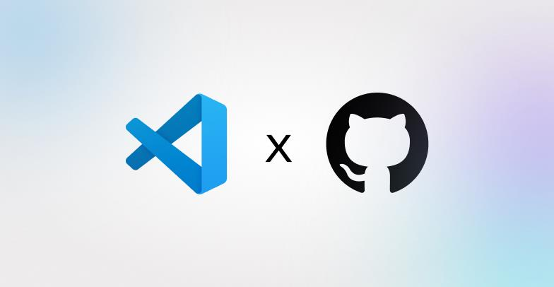

<p align="center" style="text-align:center">
  
  
</p>

* :rocket: Serena is a powerful **coding agent toolkit** capable of turning an LLM into a fully-featured agent that works **directly on your codebase**.
  Unlike most other tools, it is not tied to an LLM, framework or an interface, making it easy to use it in a variety of ways.
* :wrench: Serena provides essential **semantic code retrieval and editing tools** that are akin to an IDE's capabilities, extracting code entities at the symbol level and exploiting relational structure. When combined with an existing coding agent, these tools greatly enhance (token) efficiency.
* :free: Serena is **free & open-source**, enhancing the capabilities of LLMs you already have access to free of charge.

You can think of Serena as providing IDE-like tools to your LLM/coding agent. 
With it, the agent no longer needs to read entire files, perform grep-like searches or basic string replacements to find the right parts of the code and to edit code. 
Instead, it can use code-centric tools like `find_symbol`, `find_referencing_symbols` and `insert_after_symbol`.

<p align="center">
  <em>Serena is under active development! See the latest updates, upcoming features, and lessons learned to stay up to date.</em>
</p>

<p align="center">
  <a href="CHANGELOG.md"></a>
  <a href="roadmap.md"></a>
  <a href="lessons_learned.md"></a>
</p>

## LLM Integration

Serena provides the necessary [tools](https://oraios.github.io/serena/01-about/035_tools.html) for coding workflows, but an LLM is required to do the actual work,
orchestrating tool use.

In general, Serena can be integrated with an LLM in several ways:

* by using the **model context protocol (MCP)**.
  Serena provides an MCP server which integrates with
    * Claude Code and Claude Desktop,
    * terminal-based clients like Codex, Gemini-CLI, Qwen3-Coder, rovodev, OpenHands CLI and others,
    * IDEs like VSCode, Cursor or IntelliJ,
    * Extensions like Cline or Roo Code
    * Local clients like [OpenWebUI](https://docs.openwebui.com/openapi-servers/mcp), [Jan](https://jan.ai/docs/mcp-examples/browser/browserbase#enable-mcp), [Agno](https://docs.agno.com/introduction/playground) and others
* by using [mcpo to connect it to ChatGPT](docs/03-special-guides/serena_on_chatgpt.md) or other clients that don't support MCP but do support tool calling via OpenAPI.
* by incorporating Serena's tools into an agent framework of your choice, as illustrated [here](docs/03-special-guides/custom_agent.md).
  Serena's tool implementation is decoupled from the framework-specific code and can thus easily be adapted to any agent framework.

## Serena in Action

#### Demonstration 1: Efficient Operation in Claude Code

A demonstration of Serena efficiently retrieving and editing code within Claude Code, thereby saving tokens and time. Efficient operations are not only useful for saving costs, but also for generally improving the generated code's quality. This effect may be less pronounced in very small projects, but often becomes of crucial importance in larger ones.

https://github.com/user-attachments/assets/ab78ebe0-f77d-43cc-879a-cc399efefd87

#### Demonstration 2: Serena in Claude Desktop

A demonstration of Serena implementing a small feature for itself (a better log GUI) with Claude Desktop.
Note how Serena's tools enable Claude to find and edit the right symbols.

https://github.com/user-attachments/assets/6eaa9aa1-610d-4723-a2d6-bf1e487ba753

### Programming Language Support & Semantic Analysis Capabilities

Serena's semantic code analysis capabilities build on **language servers** using the widely implemented
language server protocol (LSP). The LSP provides a set of versatile code querying
and editing functionalities based on symbolic understanding of the code.
Equipped with these capabilities, Serena discovers and edits code just like a seasoned developer
making use of an IDE's capabilities would.
Serena can efficiently find the right context and do the right thing even in very large and
complex projects! So not only is it free and open-source, it frequently achieves better results
than existing solutions that charge a premium.

Language servers provide support for a wide range of programming languages.
With Serena's LSP library, we provide **support for over 30 programming languages**, including
AL, Bash, C#, C/C++, Clojure, Dart, Elixir, Elm, Erlang, Fortran, Go, Haskell, Java, Javascript, Julia, Kotlin, Lua, Markdown, Nix, Perl, PHP, Python, R, Ruby, Rust, Scala, Swift, TypeScript, YAML and Zig.

> [!IMPORTANT]
> Some languages require additional dependencies to be installed; see the [Language Support](https://oraios.github.io/serena/01-about/020_programming-languages.html) page for details.

## Quick Start

**Prerequisites**. Serena is managed by *uv*. If you don’t already have it, you need to [install uv](https://docs.astral.sh/uv/getting-started/installation/) before proceeding.

**Starting the MCP Server**. The easiest way to start the Serena MCP server is by running the latest version from GitHub using uvx.
Issue this command to see available options:

```bash
uvx --from git+https://github.com/oraios/serena serena start-mcp-server --help
```

**Configuring Your Client**. To connect Serena to your preferred MCP client, you typically need to [configure a launch command in your client](https://oraios.github.io/serena/02-usage/030_clients.html).
Follow the link for specific instructions on how to set up Serena for Claude Code, Codex, Claude Desktop, MCP-enabled IDEs and other clients (such as local and web-based GUIs). 

> [!TIP]
> While getting started quickly is easy, Serena is a powerful toolkit with many configuration options.
> We highly recommend reading through the [user guide](https://oraios.github.io/serena/02-usage/000_intro.html) to get the most out of Serena.
> 
> Specifically, we recommend to read about ...
>   * [Serena's project-based workflow](https://oraios.github.io/serena/02-usage/040_workflow.html) and
>   * [configuring Serena](https://oraios.github.io/serena/02-usage/050_configuration.html).

## User Guide

Please refer to the [user guide](https://oraios.github.io/serena/02-usage/000_intro.html) for detailed instructions on how to use Serena effectively.

## Community Feedback

Most users report that Serena has strong positive effects on the results of their coding agents, even when used within
very capable agents like Claude Code. Serena is often described to be a [game changer](https://www.reddit.com/r/ClaudeAI/comments/1lfsdll/try_out_serena_mcp_thank_me_later/), providing an enormous [productivity boost](https://www.reddit.com/r/ClaudeCode/comments/1mguoia/absolutely_insane_improvement_of_claude_code).

Serena excels at navigating and manipulating complex codebases, providing tools that support precise code retrieval and editing in the presence of large, strongly structured codebases.
However, when dealing with tasks that involve only very few/small files, you may not benefit from including Serena on top of your existing coding agent.
In particular, when writing code from scratch, Serena will not provide much value initially, as the more complex structures that Serena handles more gracefully than simplistic, file-based approaches are yet to be created.

Several videos and blog posts have talked about Serena:

* YouTube:
    * [AI Labs](https://www.youtube.com/watch?v=wYWyJNs1HVk&t=1s)
    * [Yo Van Eyck](https://www.youtube.com/watch?v=UqfxuQKuMo8&t=45s)
    * [JeredBlu](https://www.youtube.com/watch?v=fzPnM3ySmjE&t=32s)

* Blog posts:
    * [Serena's Design Principles](https://medium.com/@souradip1000/deconstructing-serenas-mcp-powered-semantic-code-understanding-architecture-75802515d116)
    * [Serena with Claude Code (in Japanese)](https://blog.lai.so/serena/)
    * [Turning Claude Code into a Development Powerhouse](https://robertmarshall.dev/blog/turning-claude-code-into-a-development-powerhouse/)

## Acknowledgements

### Sponsors

We are very grateful to our [sponsors](https://github.com/sponsors/oraios) who help us drive Serena's development. The core team
(the founders of [Oraios AI](https://oraios-ai.de/)) put in a lot of work in order to turn Serena into a useful open source project. 
So far, there is no business model behind this project, and sponsors are our only source of income from it.

Sponsors help us dedicating more time to the project, managing contributions, and working on larger features (like better tooling based on more advanced
LSP features, VSCode integration, debugging via the DAP, and several others).
If you find this project useful to your work, or would like to accelerate the development of Serena, consider becoming a sponsor.

We are proud to announce that the Visual Studio Code team, together with Microsoft’s Open Source Programs Office and GitHub Open Source
have decided to sponsor Serena with a one-time contribution!

<p align="center">
  
</p>

### Community Contributions

A significant part of Serena, especially support for various languages, was contributed by the open source community.
We are very grateful for the many contributors who made this possible and who played an important role in making Serena
what it is today.

### Technologies
We built Serena on top of multiple existing open-source technologies, the most important ones being:

1. [multilspy](https://github.com/microsoft/multilspy).
   A library which wraps language server implementations and adapts them for interaction via Python.
   It provided the basis for our library Solid-LSP (`src/solidlsp`).
   Solid-LSP provides pure synchronous LSP calls and extends the original library with the symbolic logic
   that Serena required.
2. [Python MCP SDK](https://github.com/modelcontextprotocol/python-sdk)
3. All the language servers that we use through Solid-LSP.

Without these projects, Serena would not have been possible (or would have been significantly more difficult to build).

## Customizing and Extending Serena

It is straightforward to extend Serena's AI functionality with your own ideas.
Simply implement a new tool by subclassing
`serena.agent.Tool` and implement the `apply` method with a signature
that matches the tool's requirements.
Once implemented, `SerenaAgent` will automatically have access to the new tool.

It is also relatively straightforward to add [support for a new programming language](/.serena/memories/adding_new_language_support_guide.md).

We look forward to seeing what the community will come up with!
For details on contributing, see [contributing guidelines](/CONTRIBUTING.md).
